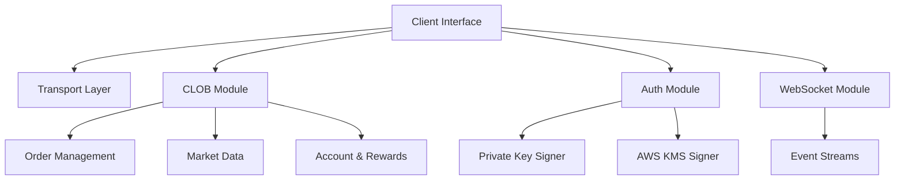

# Polymarket Go SDK

[](https://github.com/GoPolymarket/polymarket-go-sdk/actions)
[](https://pkg.go.dev/github.com/GoPolymarket/polymarket-go-sdk)
[](https://opensource.org/licenses/Apache-2.0)

**Official docs alignment:** Implements Polymarket Order Attribution (builder auth headers for leaderboard/grants) and follows the Builder Authentication/Remote Signing guidance referenced by the Relayer Client docs; official docs: [Order Attribution](https://docs.polymarket.com/developers/builders/order-attribution), [Relayer Client](https://docs.polymarket.com/developers/builders/relayer-client).

An unofficial, production-ready, and feature-complete Go SDK for the Polymarket CLOB (Central Limit Order Book). Designed for high-frequency trading, market making, and data analysis.

> **Note**: This is a community-maintained project and is not officially affiliated with Polymarket. We aim to provide a high-quality, spec-compliant implementation that can be relied upon by professionals.

## ✨ Key Features

- **🛡️ Type-Safe & Robust**: Fully typed API responses and requests using standard Go patterns.
- **🚀 High Performance**: Optimized for low-latency trading with efficient HTTP and WebSocket handling.
- **🔌 WebSocket Recovery**: Built-in "dead connection" detection and automatic reconnection logic (heartbeat monitoring).
- **🔐 Secure Authentication**:
    - Supports L1 (EIP-712) and L2 (HMAC) signing.
    - **Proxy Wallet & Gnosis Safe**: Deterministic address derivation for smart contract wallets.
    - **AWS KMS**: Plug-and-play support for enterprise-grade key management.
- **🧩 Modular Architecture**: Clean separation of concerns (CLOB, Account, Market Data, WebSocket).
- **🏗️ Builder Attribution**: Easy configuration for builder rewards attribution.

## 🏗 Architecture

The SDK is organized into modular packages to ensure maintainability and extensibility:



- **`pkg/clob`**: The core client for REST API interactions (Orders, Markets, Account).
- **`pkg/clob/ws`**: Robust WebSocket client with auto-reconnect and typed event channels.
- **`pkg/auth`**: Cryptographic primitives for EIP-712 signing and HMAC generation.
- **`pkg/transport`**: HTTP transport layer handling signing injection, retries, and error parsing.

## 🚀 Installation

```bash
go get github.com/GoPolymarket/polymarket-go-sdk
```

## 🛠 Quick Start

### 1. Initialize Client & Authentication

```go
package main

import (
	"context"
	"fmt"
	"log"
	"os"

	"github.com/GoPolymarket/polymarket-go-sdk"
	"github.com/GoPolymarket/polymarket-go-sdk/pkg/auth"
	"github.com/GoPolymarket/polymarket-go-sdk/pkg/clob"
	"github.com/GoPolymarket/polymarket-go-sdk/pkg/clob/clobtypes"
)

func main() {
	// 1. Initialize Signer (Private Key or KMS)
	pk := os.Getenv("POLYMARKET_PK")
	signer, err := auth.NewPrivateKeySigner(pk, 137) // 137 = Polygon Mainnet
	if err != nil {
		log.Fatal(err)
	}

	// 2. Initialize Credentials
	creds := &auth.APIKey{
		Key:        os.Getenv("POLY_API_KEY"),
		Secret:     os.Getenv("POLY_API_SECRET"),
		Passphrase: os.Getenv("POLY_API_PASSPHRASE"),
	}

	// 3. Create Client
	client := polymarket.NewClient().WithAuth(signer, creds)

	// 4. Check System Status
	status, _ := client.CLOB.Health(context.Background())
	fmt.Println("System Status:", status)
}
```

### 2. Place an Order (Complex Signing Made Easy)

The SDK handles the complex EIP-712 hashing and signing automatically.

```go
ctx := context.Background()

// Create an order builder
resp, err := client.CLOB.CreateOrder(ctx,
    clob.NewOrderBuilder(client.CLOB, signer).
        TokenID("TOKEN_ID_HERE").
        Side("BUY").
        Price(0.50).
        Size(100.0).
        OrderType(clobtypes.OrderTypeGTC).
        Build(),
)

if err != nil {
    log.Fatal("Order failed:", err)
}
fmt.Printf("Order Placed: %s\n", resp.ID)
```

### 3. Stream Market Data (WebSocket)

```go
wsClient := client.CLOB.WS()
defer wsClient.Close()

// Subscribe to price updates
sub, err := wsClient.SubscribePrices(ctx, []string{"TOKEN_ID_HERE"})
if err != nil {
    log.Fatal(err)
}

for event := range sub {
    fmt.Printf("New Price for %s: %s\n", event.AssetID, event.Price)
}
```

### 4. Fetch All Markets (Auto-Pagination)

Forget about manually handling `next_cursor`.

```go
// Automatically iterates through all pages
allMarkets, err := client.CLOB.MarketsAll(ctx, &clobtypes.MarketsRequest{
    Active: boolPtr(true),
})
if err != nil {
    log.Fatal(err)
}
fmt.Printf("Fetched %d active markets\n", len(allMarkets))
```

### 5. Balance/Allowance & Rewards (Signature Type)

Balance/allowance requests now support `asset_type`, `token_id`, and `signature_type` (with `asset` kept for compatibility). Responses return an `allowances` map keyed by spender address.

```go
// Set a default signature type for balance/rewards queries (0=EOA, 1=Proxy, 2=Safe)
client = client.WithSignatureType(auth.SignatureProxy)

bal, err := client.CLOB.BalanceAllowance(ctx, &clobtypes.BalanceAllowanceRequest{
    AssetType: clobtypes.AssetTypeConditional,
    TokenID:   "TOKEN_ID_HERE",
})
if err != nil {
    log.Fatal(err)
}
fmt.Println("Balance:", bal.Balance)
fmt.Println("Allowances:", bal.Allowances)

rewards, err := client.CLOB.UserRewardsByMarket(ctx, &clobtypes.UserRewardsByMarketRequest{
    Date:          "2026-01-01",
    OrderBy:       "date",
    NoCompetition: true,
})
if err != nil {
    log.Fatal(err)
}
fmt.Printf("User rewards: %d entries\n", len(rewards))
```

### 6. Client Defaults (Signature / Nonce / Funder / Salt)

You can set client-level defaults that apply to order signing and API key creation:
- `WithSignatureType` applies to order signing and balance/rewards queries.
- `WithAuthNonce` becomes the default nonce for create/derive API key calls.
- `WithFunder` sets a maker address override (Proxy/Safe flows).
- `WithSaltGenerator` customizes order salt generation.

```go
client := polymarket.NewClient()

authClient := client.CLOB.
    WithAuth(signer, nil).
    WithSignatureType(auth.SignatureProxy).
    WithAuthNonce(1).
    WithSaltGenerator(func() (*big.Int, error) {
        return big.NewInt(42), nil
    })

// Optional: explicit funder address for proxy/safe signatures
authClient = authClient.WithFunder(common.HexToAddress("0xFunder..."))

builder := clob.NewOrderBuilder(authClient, signer).
    TokenID("TOKEN_ID_HERE").
    Side("BUY").
    Price(0.5).
    Size(10).
    TickSize("0.01").
    FeeRateBps(0)

signable, _ := builder.BuildSignableWithContext(ctx)
fmt.Println("Maker:", signable.Order.Maker.Hex())
```

See `examples/client_defaults` for a runnable version.

### 7. StreamData (Generic Pagination Helper)

Use `clob.StreamData` to iterate through any cursor-based endpoint without writing a custom loop:

```go
stream := clob.StreamData(ctx, func(ctx context.Context, cursor string) ([]clobtypes.Market, string, error) {
    resp, err := client.CLOB.Markets(ctx, &clobtypes.MarketsRequest{
        Limit:  3,
        Cursor: cursor,
    })
    if err != nil {
        return nil, "", err
    }
    return resp.Data, resp.NextCursor, nil
})

for res := range stream {
    if res.Err != nil {
        log.Fatal(res.Err)
    }
    fmt.Println(res.Item.Question)
}
```

See `examples/stream_data` for a runnable version.

## 🛡️ Best Practices

### 1. Structured Error Handling

The SDK provides typed errors in `pkg/clob/cloberrors` to help you handle trading failures programmatically.

```go
import (
    "errors"
    "github.com/GoPolymarket/polymarket-go-sdk/pkg/clob/cloberrors"
)

resp, err := client.CLOB.CreateOrder(ctx, order)
if err != nil {
    if errors.Is(err, cloberrors.ErrInsufficientFunds) {
        fmt.Println("Please deposit more USDC")
    } else if errors.Is(err, cloberrors.ErrRateLimitExceeded) {
        fmt.Println("Backing off due to rate limits...")
    }
}
```

### 2. High-Precision Orders

Always use `decimal.Decimal` (via `PriceDec` or `SizeDec`) when precision is critical to avoid floating-point issues common in financial applications.

```go
builder.PriceDec(decimal.NewFromFloat(0.5001)).
        SizeDec(decimal.NewFromInt(100))
```

### 3. Remote Builder Attribution

If you are developing a client-side application (Web/Mobile) and want to receive builder rewards without exposing your `Builder Secret` to the end users, you can use the **Remote Signer** pattern.

1.  Deploy the standalone signer service found in `cmd/signer-server` to your secure infrastructure (support for Docker included).
2.  Configure your client to use the remote signer:

```go
client := polymarket.NewClient(
    polymarket.WithBuilderConfig(&auth.BuilderConfig{
        Remote: &auth.BuilderRemoteConfig{
            Host: "https://your-signer-api.com/v1/sign-builder",
        },
    }),
)
```

If you need to switch an already-authenticated client into builder attribution mode (and restart heartbeats with the new headers), use `PromoteToBuilder`:

```go
builderClient := authClient.PromoteToBuilder(myBuilderConfig)
```

## 🗺 Roadmap

We are committed to maintaining this SDK as the best-in-class solution for Polymarket.

- [x] **Core CLOB REST API**: Complete coverage of Order, Market, and Account endpoints.
- [x] **WebSocket Client**: Robust, auto-reconnecting stream client with heartbeat.
- [x] **Authentication**: Support for EOA, Proxy, Safe, and AWS KMS.
- [x] **Pagination**: Helper methods for automatic resource iteration (`MarketsAll`, `OrdersAll`).
- [x] **Gamma API**: Read-only metadata and discovery services.
- [x] **CI/CD**: Linting, Testing, and strictly enforced Coverage.
- [ ] **Institutional Performance Benchmarking**: High-throughput stress testing and tick-to-trade latency analysis.
- [ ] **CTF Exchange**: Direct interaction with the CTF Exchange contract for on-chain actions.
- [ ] **CLI Tool**: A standalone CLI for managing orders and keys.

## 🤝 Contributing

Contributions are welcome! Please check out the `examples/` directory for more usage patterns.

1.  Fork the repository.
2.  Create your feature branch (`git checkout -b feature/amazing-feature`).
3.  Commit your changes (`git commit -m 'Add some amazing feature'`).
4.  Push to the branch (`git push origin feature/amazing-feature`).
5.  Open a Pull Request.

**Requirements**:
*   Pass `go test ./...`
*   Pass `golangci-lint run ./...`
*   Maintain >10% test coverage (strictly enforced by CI).

## 📜 License

Distributed under the Apache License 2.0. See `LICENSE` for more information.

---

*This project is an independent effort to provide a high-quality Go ecosystem for Polymarket. If you find it useful, please star the repo!*
